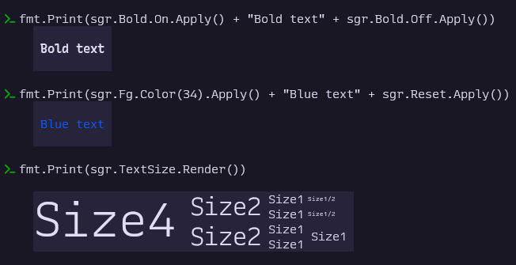

# _sgr_: SGR & General Ansi Escape Codes Helper

A Go package for working with all ANSI Escape Codes, not actually limited to just SGR (Select Graphic Rendition) codes. Meant as a reference and toolkit for terminal UI and CLI developers

## Goals
- Provide helper methods for emitting and composing ANSI codes, including complex sequences and responses such as [text sizing protocol detection](https://sw.kovidgoyal.net/kitty/text-sizing-protocol/#detecting-if-the-terminal-supports-this-protocol)
- Comprehensive coverage of current and historical escape codes
- Provide associated metadata:
  - Use syntax (where applicable)
  - Human-friendly names
  - Abbreviations (when available)
  - Unicode glyphs (when available)
  - (Planned) Support status (obsolete or not)


## Implemented
- Support ANSI codes for setting and resetting text size relating to [kitty's text sizing protocol](https://sw.kovidgoyal.net/kitty/text-sizing-protocol/)
- Struct-based Go API (currently; final interface TBD)
- Methods for generating, applying, and rendering escape codes
- Name and code number for over 100 control codes
- Showcase methods (where it makes sense): returns a sample string where the relevant ANSI Code has been applied. Will use own command syntax notation as the showcase string in the future.
- Helpers for color, font, cursor, and screen control


## Data structure & Methods Example
```go
TextSize = struct {
	Apply  func(meta ...string) string
	Off    func() string
	Name   func() string
	Code   func() string
	Render func() string // Render() is the showcase method. To be renamed.
}{
	Apply: func(meta ...string) string { return "\x1b\x5d66;" + string(meta[0]) + ";" },
	Off:  func() string { return "\x07" },
	Name: func() string { return "Text Size (kitty)" },
	Code: func() string { return "66" },
	Render: func() string { return "\x1b\x5d66;s=4;Size4\x07" + "\x1b\x5d66;s=2:v=1; Size2\x07" + "\x1b\x5d66;s=1:v=1; Size1\x07" +
        "\x1b\x5d66;n=1:d=2:v=2:w=8; Size1/2\x07\n" + "\x1b\x5d66;s=1:v=1; Size1\x07" + "\x1b\x5d66;n=1:d=2:v=2:w=8; Size1/2\x07\n" +
        "\x1b\x5d66;s=2:v=0; Size2\x07" + "\x1b\x5d66;s=1:v=1; Size1 \x07" + "\x1b\x5d66;s=2:n=1:d=2:v=2:w=3;Size1 \x07\n" +
        "\x1b\x5d66;s=1:v=1; Size1\x07 " }
}
```

## Status
- API and interfaces are still being decided and are subject to change. Comments more than welcome.

## License
GPL v3.0 or later
